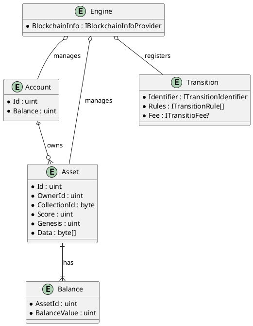
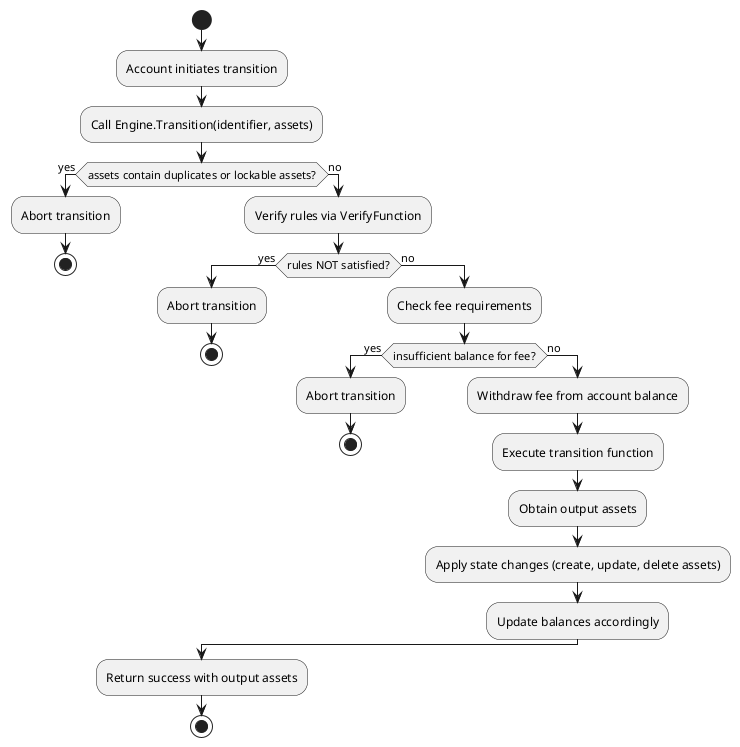

# Name of your Project

> [!NOTE]
> This document will be part of the terms and conditions of your agreement and, therefore, needs to contain all the required information about the project. Don't remove any of the mandatory parts presented in bold letters or as headlines (except for the title)! Lines starting with a `>` (such as this one) should be removed. Please use markdown instead of HTML (e.g., `` instead of ``).
>
> See the [Grants Program Process](https://grants.web3.foundation/docs/process) on how to submit a proposal.

- **Team Name:** Ajuna Network
- **Payment Details:**
  - **DOT**: 16AjunUasoBZKWkDnHvNEALGUgGuzC92j7LJoLu9qBSUJB2e
  - **Payment**: 16AjunUasoBZKWkDnHvNEALGUgGuzC92j7LJoLu9qBSUJB2e (USDC).
- **[Level](https://grants.web3.foundation/docs/Introduction/levels):** 2

> [!IMPORTANT]
> *The combination of your GitHub account submitting the application and the payment address above will be your unique identifier during the program. Please keep them safe.*

## Project Overview :page_facing_up:

This application is a **follow-up grant** to the previous **Ajuna Network / Jeton Network grants**, including work on the Substrate Unity SDK and gaming framework (referencing the previous Open Grants Program application).

**Project Name:** Substrate Asset Game Engine (SAGE)

**Tagline:** A modular, instanced Substrate framework for building blockchain-based games with reusable logic, asset handling, and developer-friendly tooling.

**Description:**
SAGE is designed to reduce the complexity of building blockchain games on Substrate by providing a flexible, reusable **state machine framework** with key features:
- Asset creation, mutation, and trading (compatible with pallet-assets/NFT standards).
- Generic transitions for game state progression.
- Season, tournament, and leaderboard management.
- Support for modular gameplay logic, with **multiple entry points** for developers to plug in game-specific logic.
- Affiliation hooks for referral programs.
- Manager/admin roles to configure features dynamically.
- Terminal UI and developer playground for quick testing and integration.

SAGE evolved from the **Awesome Ajuna Avatars** project, currently live on **Bajun Network** and available as a mobile game ([bbb.ajuna.io](https://bbb.ajuna.io)) ([Google Play](https://play.google.com/store/apps/details?id=io.ajuna.bbb)). After experiencing high complexity onboarding other projects onto AAA, we redesigned and modularized SAGE to be the **go-to framework for future Substrate-based games**.

### Project Details

#### SAGE Game Framework

The SAGE Game Framework is a modular engine designed for game state management using an asset-based, state-transition model. Instead of using a traditional database, SAGE stores state directly on "assets" (e.g., game cards), and state changes are performed by executing transitions that consume and produce assets. This architecture allows for a flexible, decentralized, and extensible game design.

##### Core Concepts

- **Account:**
  Represents a player or system account. Each account is identified by a unique ID and holds a balance.

- **Asset:**
  The fundamental game object. Assets have an owner (`OwnerId`), a collection identifier, a score, a genesis timestamp, and a data array (often referred to as DNA) that encodes various properties using compact, bit-level operations.

- **Balance:**
  Tracks funds for both accounts and assets. Asset-specific balances are managed separately from overall account balances.

- **Transition:**
  A state change operation that is defined by:
  - A unique **Identifier** (encapsulated by an `ITransitionIdentifier`)
  - A set of **Rules** (implementing `ITransitionRule`)
  - An optional **Fee**
  - A **Transition Function** that computes new assets (the updated state) from the provided inputs

- **Engine:**
  The central component that manages accounts, assets, balances, and transitions. It relies on external providers (like a blockchain info provider) for block numbers and randomness.

##### Architecture Overview

The following Entity-Relationship (ER) diagram shows the relationships between the key entities:

##### Transition Execution Flow

The following UML activity diagram illustrates the high-level flow of a state transition within the engine:

##### Summary

By separating accounts, assets, balances, and transitions, the SAGE Game Framework provides a robust foundation for developing complex, asset-based games. Its modular design and use of state transitions make it highly adaptable for various game genres and mechanics.

- Mockups/designs of any UI components
- Data models / API specifications of the core functionality
- An overview of the technology stack to be used
- Documentation of core components, protocols, architecture, etc. to be deployed
- PoC/MVP or other relevant prior work or research on the topic
- What your project is *not* or will *not* provide or implement
  - This is a place for you to manage expectations and clarify any limitations that might not be obvious

Things that shouldn’t be part of the application (see also our [FAQ](../docs/faq.md)):

- The (future) tokenomics of your project
- For non-infrastructure projects—deployment and hosting costs, maintenance or audits
- Business-oriented activities (marketing, business planning), events or outreach

### Ecosystem Fit

Help us locate your project in the Polkadot/Substrate/Kusama landscape and what problems it tries to solve by answering each of these questions:

- Where and how does your project fit into the ecosystem?
- Who is your target audience (parachain/dapp/wallet/UI developers, designers, your own user base, some dapp's userbase, yourself)?
- What need(s) does your project meet?
- How did you identify these needs? Please provide evidence in the form of (scientific) articles, forum discussions, case studies, or raw data.
- Are there any other projects similar to yours in the Substrate / Polkadot / Kusama ecosystem?
  - If so, how is your project different? Please identify and assess any projects addressing the same need and explain how your project is distinct. Feel free to include applicable research data, statistics, or metrics.
  - If not, please indicate why such a project might not have been possible, successful, or attempted.
- Are there any projects similar to yours in related ecosystems?

## Team :busts_in_silhouette:

- Cedric Decoster (Solution Architect / Game Dev)
  A software engineer and solution architect for over 20 years and worked on enterprise applications in the Swiss banking sector. In his spare time, he has worked passionately on various blockchain and gaming projects for years. Cédric holds a bachelor’s degree in computer science. Lead Contributor of the SubstrateGaming Organisation and its flagship product the Substrate .NET API, and creative mind behind the products BattleMogs, Awesome Ajuna Avatars, Big Ballz of Bajun, DOT 4 Gravity, Hexalem (1st Polkadot Winter Hackathon ‘23), and more.
- Christian Langenbacher (Lead Developer, Rust)
  Major Contributor and Developer at Encointer and Integritee, building on the TEE stack, for a few years.
- Didac (Rust Developer)
- Niklas (Frontend & Rust Developer)

### Contact

- **Contact Name:** Cedric Decoster
- **Contact Email:** cedric.decoster@gmail.com
- **Website:** https://ajuna.io

### Legal Structure

- **Registered Address:** Stetten SH, Switzerland
- **Registered Legal Entity:** Bloga Tech AG

### Team's experience

The team consists of People that have been active in the Polkadot Developer Community for multiple Years, working in projects as Ajuna NEtwork, Encointer, Integritee, Polkadot Play, providing mutliple grants, but also infrastructure tool, like SDKs and APIs. We have PBA absolvent and Fellowship member, Parachain Founder.

### Team Code Repos

- https://github.com/ajuna-network
- https://github.com/SubstrateGaming
- https://github.com/PolkadotPlay

Please also provide the GitHub accounts of all team members. If they contain no activity, references to projects hosted elsewhere or live are also fine.

- https://github.com/darkfriend77
- https://github.com/clangenb
- https://github.com/DidacSF
- https://github.com/niklasp

### Team LinkedIn Profiles (if available)

- https://www.linkedin.com/in/cedric-decoster-3a004510b/
- https://www.linkedin.com/in/christian-langenbacher-baa629182
- https://www.linkedin.com/in/d%C3%ADdac-sement%C3%A9
- https://www.linkedin.com/{person_4}

## Development Status :open_book:

We already started with most of the work, and have been working on it for the past six months, obviously we had to see first if the concept works, and how it plays out. We are at the stage were we think it is a very usfull framework to be used to hack and play, with the playground to attrackt future game devs into the ecosystem, the repository will be moved to Polkadot PLay, or SubstrateGaming organisation, once we are ready.

- **Existing repo:**
  - (wip) C# Reference Implementation https://github.com/ajuna-network/Ajuna.SAGE
  - (wip) Playground: https://github.com/ajuna-network/sage-playground
  - (wip) Substrate: https://github.com/ajuna-network/ajuna-pallets/
    - (wip) https://github.com/ajuna-network/ajuna-pallets/tree/develop/sage
- **Documentation:**
  - (wip) https://wiki.ajuna.io/build-with-us/sage-substrate-asset-game-engine
- **Previous work:**
  - Precursor of SAGE: https://github.com/ajuna-network/ajuna-pallets/tree/develop/pallets/ajuna-awesome-avatars

## Development Roadmap :nut_and_bolt:

This section should break the development roadmap down into milestones and deliverables. To assist you in defining it, we have created a document with examples for some grant categories [here](../docs/Support%20Docs/grant_guidelines_per_category.md). Since these will be part of the agreement, it helps to describe *the functionality we should expect in as much detail as possible*, plus how we can verify and test that functionality. Whenever milestones are delivered, we refer to this document to ensure that everything has been delivered as expected.

Below we provide an **example roadmap**. In the descriptions, it should be clear how your project is related to Substrate, Kusama or Polkadot. We *recommend* that teams structure their roadmap as 1 milestone ≈ 1 month.

> [!CAUTION]
> If any of your deliverables are based on somebody else's work, make sure you work and publish *under the terms of the license* of the respective project and that you **highlight this fact in your milestone documentation** and in the source code if applicable! **Projects that submit other people's work without proper attribution will be immediately terminated.**

### Overview

- **Total Estimated Duration:** Duration of the whole project (e.g. 2 months)
- **Full-Time Equivalent (FTE):**  Average number of full-time employees working on the project throughout its duration (see [Wikipedia](https://en.wikipedia.org/wiki/Full-time_equivalent), e.g. 2 FTE)
- **Total Costs:** Requested amount in USD for the whole project (e.g. 12,000 USD). Note that the acceptance criteria and additional benefits vary depending on the [level](../README.md#level_slider-levels) of funding requested.
- **DOT %:** Percentage of Total Costs to be paid in (vested) DOT (≥ 50%)

### Milestone 1 Reference Implementation, Solution Architecture & Modularity

- **Estimated duration:** 1 month
- **FTE:**  2
- **Costs:** 25,000 USD

> [!NOTE]
> **The default deliverables 0a-0d below are mandatory for all milestones**, and deliverable 0e at least for the last one.

| Number | Deliverable | Specification |
| -----: | ----------- | ------------- |
| **0a.** | License | Apache 2.0 / GPLv3 / MIT / Unlicense. See the [delivery guidelines](https://grants.web3.foundation/docs/Support%20Docs/milestone-deliverables-guidelines#license) for details. |
| **0b.** | Documentation | We will provide both **inline documentation** of the code and a basic **tutorial** that explains how a user can (for example) spin up one of our Substrate nodes and send test transactions, which will show how the new functionality works. See the [delivery guidelines](https://grants.web3.foundation/docs/Support%20Docs/milestone-deliverables-guidelines#documentation) for details. |
| **0c.** | Testing and Testing Guide | Core functions will be fully covered by comprehensive unit tests to ensure functionality and robustness. In the guide, we will describe how to run these tests. See the [delivery guidelines](https://grants.web3.foundation/docs/Support%20Docs/milestone-deliverables-guidelines#testing-guide) for details. |
| **0d.** | Docker | We will provide a Dockerfile(s) that can be used to test all the functionality delivered with this milestone. |
| 0e. | Article | We will publish an **article**/workshop that explains [...] (what was done/achieved as part of the grant). (Content, language, and medium should reflect your target audience described above.) |
| 1. | Reference Implementation: Asset Transition Engine | Initial implementation of a reference transition engine, demonstrating minting, mutation, and asset validation in a modular manner, decoupled from any specific game logic. |
| 2. | Feature Evaluation Report | A comprehensive evaluation of features required for a generic Substrate game engine, comparing different approaches from existing pallets (e.g., pallet-assets, pallet-uniques) and explaining which features will be included, extended, or excluded in SAGE. |
| 3. | Modularity Design | Full design documentation covering how individual components (assets, transitions, seasons, roles, etc.) will be isolated into extensible modules, with clear extension points for custom game logic. |
| 4. | Transition Logic PoC | 	Initial implementation of generic transition logic, demonstrating how asset minting, mutation, and seasonal changes can be triggered and validated independently of game-specific rules. |
| 5. | API Design | Design and initial documentation for the SageApi, which will expose critical storage access and management functions for developers to plug into. |
| 6. | Developer Playground Setup | Basic setup for a developer playground, where developers can simulate asset transitions and test core SAGE concepts via CLI or simple web UI. |

### Milestone 2 Rust Implementation & Core Framework Development

- **Estimated Duration:** 1 month
- **FTE:**  2
- **Costs:** 25,000 USD

| Number | Deliverable | Specification |
| -----: | ----------- | ------------- |
| **0a.** | License | Apache 2.0 / GPLv3 / MIT / Unlicense. See the [delivery guidelines](https://grants.web3.foundation/docs/Support%20Docs/milestone-deliverables-guidelines#license) for details. |
| **0b.** | Documentation | We will provide both **inline documentation** of the code and a basic **tutorial** that explains how a user can (for example) spin up one of our Substrate nodes and send test transactions, which will show how the new functionality works. See the [delivery guidelines](https://grants.web3.foundation/docs/Support%20Docs/milestone-deliverables-guidelines#documentation) for details. |
| **0c.** | Testing and Testing Guide | Core functions will be fully covered by comprehensive unit tests to ensure functionality and robustness. In the guide, we will describe how to run these tests. See the [delivery guidelines](https://grants.web3.foundation/docs/Support%20Docs/milestone-deliverables-guidelines#testing-guide) for details. |
| **0d.** | Docker | We will provide a Dockerfile(s) that can be used to test all the functionality delivered with this milestone. |
| 0e. | Article | We will publish an **article**/workshop that explains [...] (what was done/achieved as part of the grant). (Content, language, and medium should reflect your target audience described above.) |
| 1. | Substrate Module: Core SAGE Pallet | Implementation of the pallet-sage, including asset management, asset transitions (mint/mutate/trade), seasons, and role-based management. |
| 2. | Substrate Module: Transition Handler | Implementation of a transition handler module, capable of processing modular transition logic (pluggable by game developers). |
| 3. | Substrate Module: SageAPI Hooks | Implementation of the SageApi, exposing player configuration, asset lookup, seasonal data, and global game configuration methods. |
| 4. | Storage Schema | Full storage schema, defining how assets, players, seasons, and transitions are stored and queried efficiently within the Substrate runtime. |
| 5. | Generic Transition Library | Reusable library of common transitions (minting, merging, mutating, splitting), easily extensible for game-specific logic. |
| 6. | Runtime Integration Example | Example Substrate runtime demonstrating how to include pallet-sage alongside other game-related pallets, with configuration examples. |
| 7. | Playground Runtime | Deployment-ready playground runtime for testing SAGE concepts locally, preloaded with assets, seasons, and sample transitions. |

### Milestone 3 UI, JavaScript SDK, Unity Integration & Developer Playground

- **Estimated Duration:** 1 month
- **FTE:**  1,5
- **Costs:** 15'000 USD

| Number | Deliverable | Specification |
| -----: | ----------- | ------------- |
| **0a.** | License | Apache 2.0 / GPLv3 / MIT / Unlicense. See the [delivery guidelines](https://grants.web3.foundation/docs/Support%20Docs/milestone-deliverables-guidelines#license) for details. |
| **0b.** | Documentation | We will provide both **inline documentation** of the code and a basic **tutorial** that explains how a user can (for example) spin up one of our Substrate nodes and send test transactions, which will show how the new functionality works. See the [delivery guidelines](https://grants.web3.foundation/docs/Support%20Docs/milestone-deliverables-guidelines#documentation) for details. |
| **0c.** | Testing and Testing Guide | Core functions will be fully covered by comprehensive unit tests to ensure functionality and robustness. In the guide, we will describe how to run these tests. See the [delivery guidelines](https://grants.web3.foundation/docs/Support%20Docs/milestone-deliverables-guidelines#testing-guide) for details. |
| **0d.** | Docker | We will provide a Dockerfile(s) that can be used to test all the functionality delivered with this milestone. |
| 0e. | Article | We will publish an **article**/workshop that explains [...] (what was done/achieved as part of the grant). (Content, language, and medium should reflect your target audience described above.) |
| 1. | JavaScript SDK | Creation of a JavaScript SDK that wraps calls to SageAPI, providing easy-to-use functions for asset lookup, transitions, and player management. |
| 2. | Unity Integration | Sample Unity project demonstrating wallet creation, asset minting, mutation, and trading, using the JavaScript SDK to interact with the Substrate node. |
| 3. | Developer Playground UI | Web-based developer playground where developers can visually create assets, trigger transitions, and inspect game state — backed by SageAPI and running on a local Substrate node. |
| 4. | Playground Backend | Node.js backend for proxying Substrate RPC calls to SageAPI, with simplified endpoints for asset management and transitions (developer-friendly). |
| 5. | CLI Tool | Simple CLI tool to simulate transitions and query asset state directly from the terminal, using the JavaScript SDK. |
| 6. | Sample Game Template | Basic game template (example: breeding game) demonstrating how developers can build fully on-chain gameplay using SAGE transitions. |
| 7. | Workshop / Demo Video | Full recorded demo showing how to set up a Substrate node with SAGE, deploy assets, run transitions, and connect both Unity and web UIs to interact with the game state. |

## Future Plans

Please include here

- how you intend to finance the project's long-term maintenance and development,
- how you intend to use, enhance, and promote your project in the short term, and
- the team's long-term plans and intentions in relation to it.

## Referral Program (optional) :moneybag:

You can find more information about the program [here](https://grants.web3.foundation/docs/referral-program).

- **Referrer:** Name of the Polkadot Ambassador or GitHub account of the Web3 Foundation grantee
- **Payment Address:** Polkadot/Kusama (USDC) payment address. Please also specify the currency. (e.g. 15oF4... (USDC))

## Additional Information :heavy_plus_sign:

**How did you hear about the Grants Program?** Web3 Foundation Website / Medium / Twitter / Element / Announcement by another team / personal recommendation / etc.

Here you can also add any additional information that you think is relevant to this application but isn't part of it already, such as:

- Work you have already done.
- If there are any other teams who have already contributed (financially) to the project.
- Previous grants you may have applied for.
